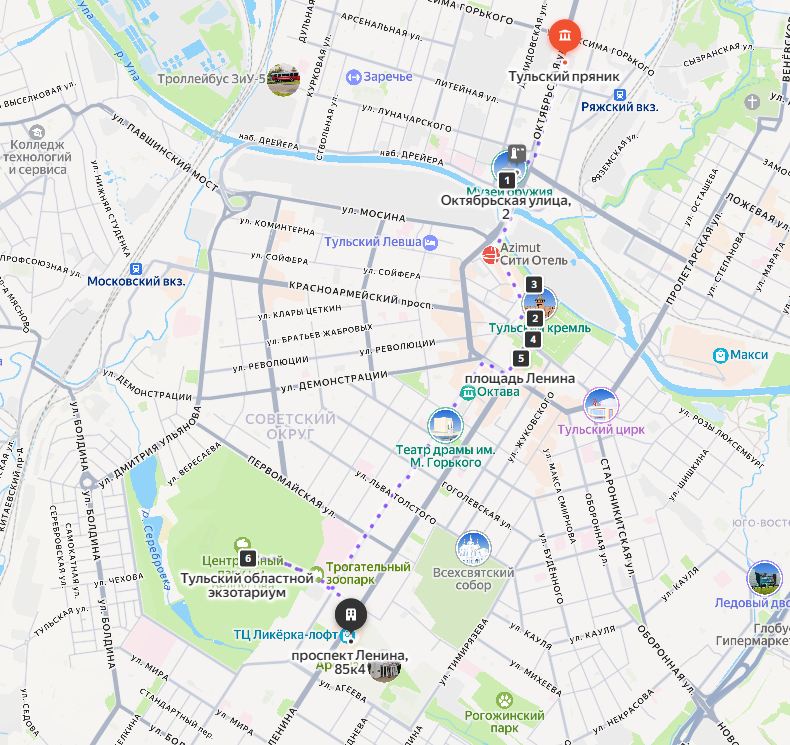

## План посещения Тулы

### 1. Музей «Тульский пряник»
   1685 год — именно эта дата стоит на документе, где впервые упоминается тульский пряник, но историки утверждают, что изготавливать эту сладость в Туле начали примерно на сто лет раньше. Так почему же тульские пряники стали самыми популярными, несмотря на то, что изготавливали их почти в каждом городе России? — Именно в Туле изготовление пряников возвели в степень искусства, а рецепты и хитрости производства передавались из поколения в поколение и держались в строгом секрете. И всё же каким-то чудом тайны изготовления тульских пряников дошли до нас, благодаря чему каждый может отведать эту вкуснейшую сладость. То что мы рассказали — это лишь капля в море истории тульских пряников, а подробнее с ней познакомиться вы сможете в музее, который так и называется — «Тульский пряник». Вам расскажут о процессе производства сладости, поведают интересные истории и факты, а в конце, конечно же, угостят свежеиспеченными пряниками с чаем.
####   Адрес: [г. Тула, ул. Октябрьская, 45а](https://yandex.ru/maps/15/tula/?ll=37.622300%2C54.211546&mode=poi&poi%5Bpoint%5D=37.622302%2C54.211545&poi%5Buri%5D=ymapsbm1%3A%2F%2Forg%3Foid%3D1154044908&z=21)

### 2. Тульский государственный музей оружия
   Тулу не зря называют оружейной столицей России, ведь ещё с XVI века здешние оружейники считались одними из лучших в стране. Обусловлено это тем, что Тула с её кремлём долгое время являлись южным рубежом страны, поэтому передовое вооружение здесь было просто необходимо. И всё же долгое время первенство в производстве оружия принадлежало Москве, но с переносом столицы в Санкт-Петербург эта роль досталась Туле. Трудно сосчитать сколько легендарного оружия сошло с местных конвейеров: винтовка Мосина, пулемет Максим, пистолет ТТ и ещё ряд другого вооружения, хорошо знакомого людям, увлекающимся этой темой. Государственный музей оружия — это отличный способ поближе познакомится с историей развития всего российского вооружения. Накапливалась коллекция ещё с XVIII века, поэтому в залах выставлены как современные модели оружия, так и те, которыми войны велись несколько веков назад.
####   Адрес: [г. Тула, ул. Октябрьская, 2](https://yandex.ru/maps/15/tula/?ll=37.616466%2C54.204026&mode=poi&poi%5Bpoint%5D=37.616499%2C54.204273&poi%5Buri%5D=ymapsbm1%3A%2F%2Forg%3Foid%3D143751708524&z=18.99)

### 3. Тульский кремль
   В начале XVI века ввиду нараставшей угрозы со стороны Крымской орды, князь Иван III отдал приказ о начале строительства в Туле защитных укреплений. В 1509 году появился деревянный острог, а пятью годами позже началась закладка каменного кремля на манер уже существовавшего тогда московского. За всё своё существование Тульский кремль не раз осаждался и становился местом действия исторических событий: здесь в 1605 году бояре присягали на верность самозванцу Лжедмитрию I, а двумя годами позднее в этих стенах нашёл убежище предводитель разгоревшегося вскоре восстания — Иван Болотников. Ко второй половине XVII столетия кремль утрачивает оборонное значение и продолжает существование в качестве памятника истории. Стоит понимать, что Тульский кремль — это не только стены, но и богатый архитектурный ансамбль внутри, о котором есть что рассказать.
####   Адрес: [г. Тула, ул. Менделеевская, 12б](https://yandex.ru/maps/15/tula/?ll=37.619455%2C54.196272&mode=poi&poi%5Bpoint%5D=37.619714%2C54.195900&poi%5Buri%5D=ymapsbm1%3A%2F%2Forg%3Foid%3D184797932729&z=16.33)

### 4 Улица Металлистов
Пешеходная улица в центре города, идет параллельно Казанской набережной от Кремля
####   Адрес: [г. Тула, ул. Металлистов](https://yandex.ru/maps/15/tula/?ll=37.616165%2C54.199120&z=18.6)

### 5. Городская набережная
   Казанская набережная в Туле открылась для посетителей совсем недавно — в 2018 году. До этого территория была занята складскими помещениями завода, из-за чего о прогулке здесь можно было только мечтать. Сегодня же Казанская набережная — это современное и комфортное общественное пространство, где можно весело и приятно провести досуг. Для спортсменов есть тренажеры, футбольное поле, прокат велосипедов, детям наверняка понравится на игровых площадках, а взрослые смогут отдохнуть в кафе или ресторане. Приятно здесь и просто прогуляться, приобщившись к безмятежной атмосфере, витающей в воздухе круглосуточно. Если будете в Туле зимой, то имейте в виду, что на набережной во время морозов заливают стометровый каток.
####   Адрес: [г. Тула, наб. Казанская](https://yandex.ru/maps/15/tula/?ll=37.616958%2C54.199449&z=18.6)

### 6. Музей «Тульские самовары»
   Пряники сами по себе вкусное лакомство, но лучше всего они раскрываются вместе с чашечкой горячего чая. Сегодня приготовление чая — это дело пяти минут, а 200 лет назад чаепитие было целым ритуалом. Готовили чай, конечно же, в самоварах, а их производство в Туле стало сродни искусству. Сомов, Михалков, братья Лисицины — эти фамилии принадлежали успешным предпринимателям, державшим фабрики по изготовлению самоваров. В музее «Тульские самовары» представлены не только модели, произведенные местными фабрикантами, но и те, что привезли из-за границы. Некоторые поражают своим изяществом, другие же вызывают невольный трепет, ведь будучи изготовленными несколько веков назад, являются настоящей частичкой истории. Выставка весьма необычная и интересная, поэтому вы наверняка проведете час-другой за её изучением.
####   Адрес: [г. Тула, ул. Менделеевская, 8](https://yandex.ru/maps/15/tula/?ll=37.618986%2C54.194269&mode=poi&poi%5Bpoint%5D=37.618820%2C54.194320&poi%5Buri%5D=ymapsbm1%3A%2F%2Forg%3Foid%3D80952796062&z=18.81)

### 7. Памятник тульскому прянику
   Стоит признать тот факт, что Тула всё ещё неразрывно ассоциируется именно с пряниками. Исходя из этого, установка памятника главному символу города была лишь вопросом времени. В 2014 году на главной городской площади состоялось праздничное мероприятие, посвященное открытию памятника Тульскому прянику, на котором гордо красуется надпись «…известен с 1685 года». Многие горожане положительно оценили появление огромного бронзового пряника Туле, а для приезжих памятник стал своего рода туристической Меккой. Если настоящий тульский пряник весит в среднем около 150 грамм, то его изваяние тяжелее на 1,3 тонны.
####   Адрес: [г. Тула, пл. Ленина](https://yandex.ru/maps/15/tula/?indoorLevel=1&ll=37.618274%2C54.192811&mode=poi&poi%5Bpoint%5D=37.618357%2C54.192724&poi%5Buri%5D=ymapsbm1%3A%2F%2Forg%3Foid%3D159368663545&z=18.37)

### 8. Тульский экзотариум
   Тульский экзотариум входит в десятку лидеров зоопарков России по количеству содержащихся видов животных. Открылся он впервые в 1987 году и представил посетителям около 120 видов животных. Через 35 лет количество обитателей экзотариума выросло в несколько раз, а больше всего зоопарк известен благодаря огромной коллекции змей, насчитывающих примерно 500 видов и подвидов. Обитают здесь и привычные нам рыбы, еноты, ежи, мартышки, шиншиллы и другие милые и пушистые животные, которых там любят дети. Поэтому, если вы приехали посмотреть Тулу с детьми, рекомендуем устроить им небольшой праздник и познакомить с богатым разнообразием животных Тульского экзотариума. Экспозиции расположены в двух зданиях.
####   Адрес: [г. Тула, ул. Октябрьская, 26 / ЦПКиО им. П. П. Белоусова, 10](https://yandex.ru/maps/15/tula/?ll=37.598118%2C54.177127&mode=poi&poi%5Bpoint%5D=37.589001%2C54.180863&poi%5Buri%5D=ymapsbm1%3A%2F%2Forg%3Foid%3D103213034644&z=15.11)

### 9. Памятник Левше и скульптура «Укрощение блохи»
   «Левша» — известный сказ Николая Лескова, повествующий о том, как император Александр I привёз из Англии крошечную металлическую блоху, умевшую танцевать. Его брат Николай I поручил донскому казаку Платову найти тех, кто смог бы превзойти по мастерству англичан. Платов отдал блоху тульскому мастеру по прозвищу Левша, а получив ее обратно никаких перемен не заметил. Однако с помощью микроскопа удалось выяснить, что Левша смог подковать блоху, чем заслужил награду и похвалу со стороны императорского двора, а главное, показал мастерство русских ремесленников англичанам. Левша стал для нас синонимом трудолюбия и мастерства, а для туляков символом города. В память о самом известном тульском мастере в городе установили два памятника: первый довольно традиционный и изображает Левшу с блохой в руке, другой же куда более необычный. Скульптура «Укрощение блохи» изображает Левшу самым обычным человеком, а вот блоха достигает в высоту 3,5 метра и больше похожа на робота. Выглядит необычно и, не побоимся этого слова, весьма эпично.
####   Адрес: [г. Тула, ул. Советская, 2 / пр. Ленина, 85к4](https://yandex.ru/maps/15/tula/?ll=37.600202%2C54.175494&mode=poi&poi%5Bpoint%5D=37.600192%2C54.176039&poi%5Buri%5D=ymapsbm1%3A%2F%2Forg%3Foid%3D3384786701&z=17.51)

